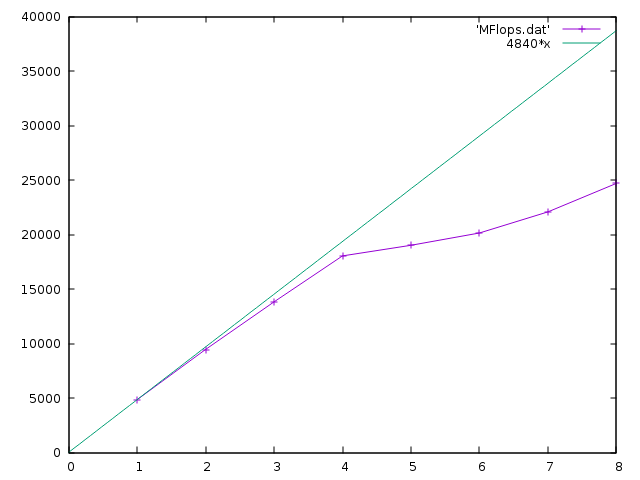

# TP2 discussions


## lscpu
```
[jd@ldmas707z Sources]$ lscpu
Architecture:          x86_64
CPU op-mode(s):        32-bit, 64-bit
Byte Order:            Little Endian
CPU(s):                8
On-line CPU(s) list:   0-7
Thread(s) per core:    2
Core(s) per socket:    4
Socket(s):             1
NUMA node(s):          1
Vendor ID:             GenuineIntel
CPU family:            6
Model:                 94
Model name:            Intel(R) Core(TM) i7-6820HQ CPU @ 2.70GHz
Stepping:              3
CPU MHz:               616.662
CPU max MHz:           3600.0000
CPU min MHz:           800.0000
BogoMIPS:              5424.00
Virtualization:        VT-x
L1d cache:             32K
L1i cache:             32K
L2 cache:              256K
L3 cache:              8192K
NUMA node0 CPU(s):     0-7
```

Sur cette machine, j'ai donc 4 "vrais" coeurs, hyperthreadés (2 thread par coeur), d'où les 8 CPUs annoncés.
Je peux donc espérer un speedup de 4 (sur les applications qui se parallèlisent bien), voire 8 sur certains cas. 


## Produit scalaire dotproduct_openmp.cpp

"pragma omp" appliqué à la boucle dans la fonction dot. 
Bien penser à mettre la réduction sur la variable `scal` (sinon résultat faux ! un `atomic` serait aussi correct, mais ralentirait le code).


Temps (wall-clock) pour le programme (N=1023, nbSamples=100000) ; 

SMP    | -O3
-------|---------
origin | 0.205195
1      | 0.217259
2      | 0.220752
3      | 0.209804
4      | 0.209943
8      | 0.342044

On ne constate aucune accélération ; c'est même légèrement contre-performant.
Cela s'explique parce que ce programme est memory-bound (pour chaque donnée lue en mémoire, il n'y a qu'une opération effectuée). Donc le paralléliser ne l'accélère pas. 


## Produit matrice-matrice


Ce programme est CPU-bound : il y a N^3 opérations à faire, pour 3*N^2 données.
Donc on peut s'attendre à de bons speedup dans les opérations parallélisées. 


Attention, faire plusieurs runs ; on peut observer une forte variabilité des performances, surtout pour les petites tailles de matrice. Par exemple avec :

```
for i in `seq 1 10`; do
    OMP_NUM_THREADS=1 ./TestProduct_opt.exe |grep MFlops
done
```
Dans les tableaux ci-dessous, on a noté la meilleure valeur des 10 runs.


### Permutation des boucles

`make TestProduct.exe && ./TestProduct.exe 1024`

  ordre           | time    | MFlops  | MFlops(n=2048) | MFlops(n=512)  | MFlops(n=4096)
------------------|---------|---------|----------------|----------------|---------------
i,j,k (origine)   | 2.73764 | 782.476 |                |                | 
j,i,k             | 3.72883 | 575.913 |                |                |
i,k,j             | 12.0426 | 172.571 |                |                |
k,i,j             | 12.0755 | 177.838 |                |                |
j,k,i             | 0.45099 | 4761.65 | 3511.59        | 5454.68        | 3416.2
k,j,i             | 0.46301 | 4638.07 | 1928.87        | 6311.08        | 1775.2

Les deux meilleurs permutations sont celles qui mettent l'indice i au plus bas niveau. 
Se référer aux explications et croquis donnés en TP : cette permutation est celle qui exploite au mieux la mémoire cache.

On remarque aussi que les performances baissent quand la taille des matrices augmente : 
les petites matrices tiennent entièrement dans le cache. 


### OMP sur la boucle jki

On décide donc de paralléliser la boucle jki par OpenMP :

`make TestProduct_opt.exe && OMP_NUM_THREADS=8 ./TestProduct_opt.exe 1024`

  OMP_NUM | MFlops(n=1024) | MFlops(n=2048) |  MFlops(n=4096)
----------|----------------|----------------|---------------
1         |   4840.25      |     2912.19    |  2777.49
2         |   9448.28      |
3         |   13823.4      |
4         |   18040.6      |
5         |   19009.2      |
6         |   20141.5      |
7         |   22080.0      |
8         |   24698.3      |

On trace cela avec gnuplot :

```
gnuplot -persist << EOF 
set xrange[0:8]
plot 'MFlops.dat' w lp
replot 4840*x
EOF
```




La courbe de speedup montre des performances (quasi) parfaites jusqu'à 4 threads ; 
puis le gain devient plus faible à partir de la 5e thread (on voit l'effet de l'hyperthreading). 


### Produit par blocs

`make TestProduct_blockomp.exe && OMP_NUM_THREADS=1 TestProduct_blockomp.exe 1024`

Pour le moment, on désactive les threads avec `OMP_NUM_THREADS=1` ; 
et on regarde l'influence de la taille de blocs :

  szBlock         | MFlops  | MFlops(n=2048) | MFlops(n=4096)
------------------|---------|----------------|---------------
origine (=max)    | 4761.65 |                |
32                | 4256.9  |                |
64                | 5009.49 |                |
128               | 5736.18 |                |
256               | 6593.25 |                |
512               | 6742.56 |   6810.54      |  6672.42
1024              | 4758.02 |                |

Avec le produit par blocs, on retrouve la meilleure performance du séquentiel (>6700 MFlops). 
Pour mon ordinateur, la meilleure taille de bloc semble être 512.
On peut d'ailleurs faire le calcul, et se rendre compte que c'est presque la taille limite pour que les 3 matrices tiennent dans le cache L3 de 8192K :
 3 (matrices) * 512^2 (nombres) * 8(sizeof double) = 6144k
 
 
Le point intéressant, c'est que quelle que soit la taille globale des matrices, on conserve les 6700 MFlops (alors qu'à la question 1, on avait vu que les performances se dégradaient pour les grosses matrices).


### Bloc + OMP

Les mesures pour cette question sont faites sur une autre machine, un peu plus vieille :

```
Architecture:          x86_64
CPU op-mode(s):        32-bit, 64-bit
Byte Order:            Little Endian
CPU(s):                8
On-line CPU(s) list:   0-7
Thread(s) per core:    2
Core(s) per socket:    4
Socket(s):             1
NUMA node(s):          1
Vendor ID:             GenuineIntel
CPU family:            6
Model:                 60
Model name:            Intel(R) Core(TM) i7-4710HQ CPU @ 2.50GHz
Stepping:              3
CPU MHz:               1099.853
CPU max MHz:           3500.0000
CPU min MHz:           800.0000
BogoMIPS:              4988.63
Virtualization:        VT-x
L1d cache:             32K
L1i cache:             32K
L2 cache:              256K
L3 cache:              6144K
NUMA node0 CPU(s):     0-7
```

La fréquence est 10% plus faible, la cache fait 6144K. Des blocs de 512 restent possibles (tout juste), et on devrait observer 10% de MFlops de moins. 

On décide de fixer le blocs à 256 pour garder un peu de marge sur la cache ; 
on place une directive `omp parallel` au-dessus de la boucle for la plus externe (celle sur les blocs). 
Et on recense les performances :

`OMP_NUM_THREADS=1 ./TestProduct_blockomp.exe 4096`

 OMP_NUM | MFlops(n=1024) | MFlops(n=4096)
---------|----------------|---------------
 1       | 5258.89        | 5024.08
 2       | 10218.1        | 9883.77
 3       | 10235.4        | 13353.1
 4       | 19898.9        | 18945
 5       | 19854.5        | 14762.5
 6       | 19720.4        | 15493.7
 7       | 20052.5        | 12076.7
 8       | 19892.5        | 16121.7

Pour N=1024, le speedup est proche de 2 pour 2 threads, de 4 pour 4 threads. 
Pour 3 threads, on n'a qu'un speedup de 2 ; il faudrait probablement jouer sur l'affinité pour placer les threads sur des CPU différents. 
À partir de 5 threads, on sature à un speedup de 4 ; pour n=1024, c'est normal, la boucle parallélisée n'a que 4 blocs à traiter. 

Pour N=4096, on a les mêmes bons speedup pour 2 et 4 threads. Pour 3, l'équilibrage s'est mieux passé que précédemment (coup de chance ?).
À partir de 5 threads, les performances se dégradent, le calcul nécessite l'hyperthreading pour gérer ces threads supplémentaires.

C'est le signe que l'hyperthreading n'est pas très performant sur cette génération de processeurs ; sur des machines plus récentes, on pourrait continuer à voir un gain.


Pour jouer sur l'affinité, on pourrait regarder ces variables :
```
export OMP_DISPLAY_ENV=true
OMP_PLACES=cores
OMP_PROC_BIND=spread
```


## Bhudda

Tout comme Mandelbrot, ce programme peut bien profiter de l'accélération OpenMP (il est CPU bound). 

Mais attention, la boucle principale du programme séquentiel :

    for ( unsigned long iSample = 0; iSample < nbSamples; ) {
 	    ...
		if(...) iSample++;
	}
	
n'est pas une boucle usuelle qu'OpenMP sait paralléliser. 
Il faut donc la modifier légèrement (cf. `bhudda_omp.cpp`).
Attention aussi à protéger par un `atomic` la ligne `image[ind] += 1;` puisque plusieurs threads peuvent passer par elle simultanément.

Noter que comme ce programme utilise un gérénateur aléatoire, les versions séquentielles et multithread donnent des résultats très légèrement différents (à peine visibles à l'oeil, mais `md5sum`, `diff -q` ou une difféerence sous gimp les repèrent).

Côté performances :

OMP_NUM_THREADS       | séq    | 1      | 2      | 4      | 8
----------------------|--------|--------|--------|--------|-------
Temps calcul Bhudda 1 | 4.245  | 4.680  | 2.955  | 1.914  | 1.219
Temps calcul Bhudda 2 | 4.446  | 4.626  | 2.631  | 1.395  | 0.781
Temps calcul Bhudda 3 | 0.272  | 0.280  | 0.161  | 0.085  | 0.048

(todo: discuter ces résultats ...)
